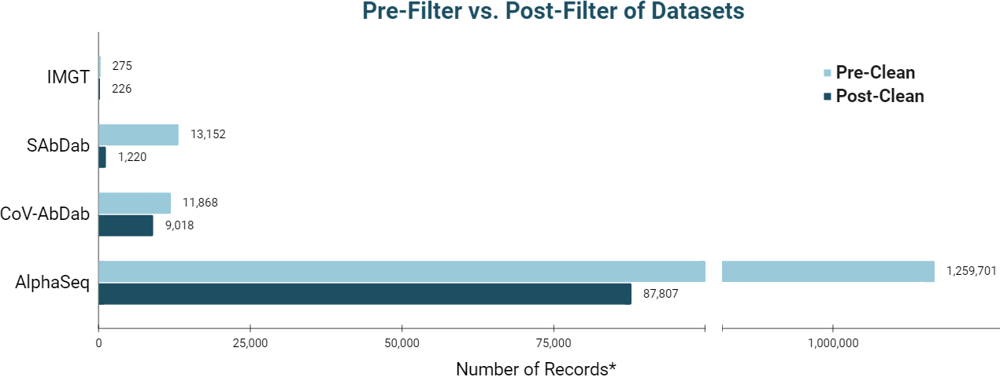
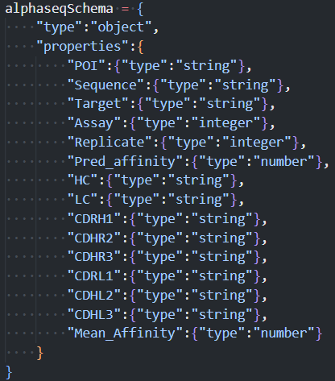
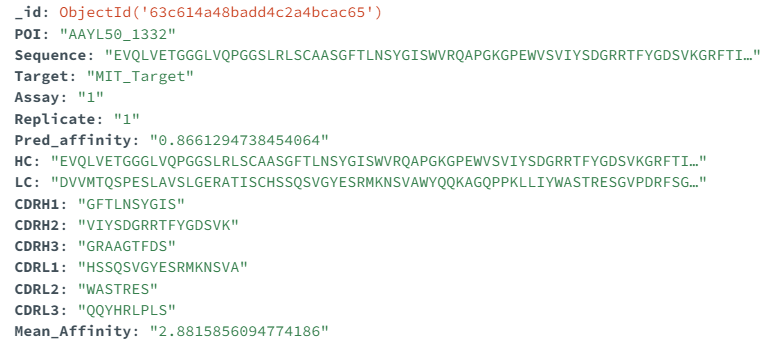
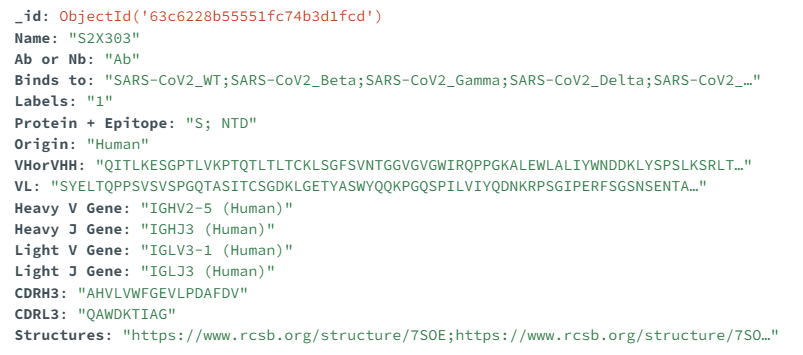
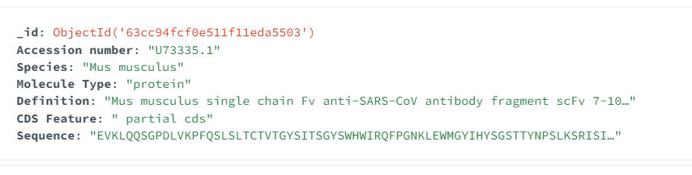
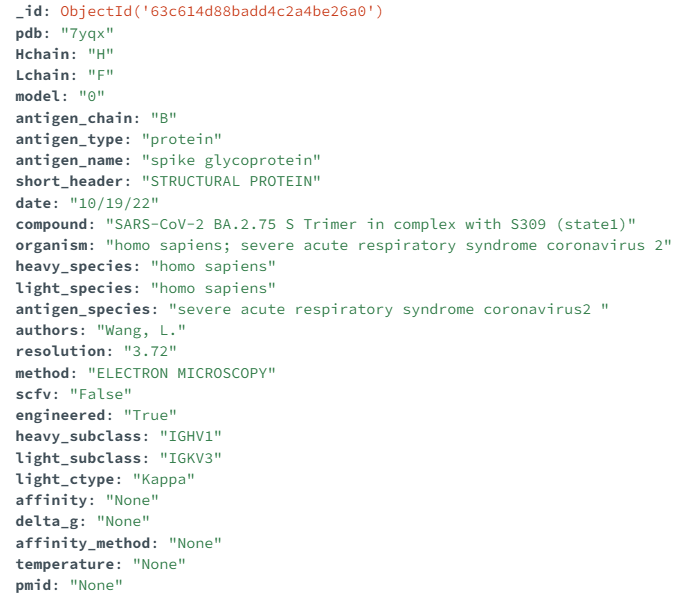

# Machine Learning Approach to a Novel Curated Covid-19 Antibody Database
### By Toni Brooks, Matt Esqueda, Rachel Ferina, and Kaetlyn Gibson

## Overview
We cleaned four publicly available Covid-19 antibody-antigen datasets to curate a MongoDB database for machine learning.
We developed a binary classification machine learning model to identify if an antibody is SARS-CoV-2 or not, as well as a regression machine learning model to predict antigen binding affinity.

## Terms to Know

| Term          | Definition                                                   |
|---------------|--------------------------------------------------------------|
| Binary        | A base-2 numeral system consisting of only two digits, 0 and 1, used to represent data in digital computing and communication systems. |
| MongoDB       | A popular NoSQL database system, designed for scalability and flexibility, storing data in a JSON-like format called BSON (Binary JSON). |
| Epoch         | A single pass through the entire training dataset during model training. |
| Binding Affinity | A measure of the strength of interaction between a receptor (e.g., antibody) and its target (e.g., antigen). |
| Antibody      | A protein produced by the immune system that binds to specific foreign substances (antigens) to neutralize or remove them. |
| Antigen       | A foreign substance (e.g., virus, bacteria, or protein) that triggers an immune response, particularly the production of antibodies. |
| Light chain   | One of the two types of polypeptide chains in an antibody molecule, smaller in size compared to the heavy chain. |
| Heavy chain   | One of the two types of polypeptide chains in an antibody molecule, larger in size compared to the light chain. |
| Overfit       | A situation where a model learns the training data too well, including noise, leading to poor generalization on unseen data. |
| Kmerization   | A technique to divide a sequence into overlapping sub-sequences (k-mers) of length k for further analysis. |
| Token         | A unit of text or sequence, representing a single character, word, or subsequence used in natural language or sequence processing. |
| Schema        | A blueprint that defines the structure, relationships, and constraints of data in a database or data model. |
| Training Data | A labeled dataset used to train a machine learning model to learn patterns and relationships in the data. |
| Testing Data  | An unlabeled dataset used to evaluate the performance of a trained machine learning model on unseen data. |
| Embedding     | A technique to convert discrete tokens or objects into continuous vectors, often used to represent words, sequences, or items in a lower-dimensional space. |
| Accuracy      | A metric that measures the proportion of correct predictions made by a classification model relative to the total number of predictions. |
| LSTM          | Long Short-Term Memory, a type of recurrent neural network architecture designed to learn and remember long-range dependencies in sequential data. |
| TAPES         | Tasks Assessing Protein Embeddings, a collection of pre-trained protein embeddings used for various protein-related machine learning tasks. |
| One-hot Embeddings | A binary representation of categorical variables, where each category is represented by a vector with a single '1' and the rest '0's. |
| Loss          | A measure of the difference between the predicted output and the actual output, used to evaluate and optimize a machine learning model. |
| Batch Size    | The number of samples processed simultaneously during model training, affecting the speed and memory requirements of the training process. |
| Learning Rate | A hyperparameter that controls the step size of weight updates during model training, influencing the convergence and accuracy of the model. |
| ...           | ...                                                          |

## Database Cleaning

**AlphaSeq:**
The [AlphaSeq](https://www.nature.com/articles/s41597-022-01779-4) data was generated from in silico experiments, with Alphaseq assays used to collect the antibodies targeted against SARS-CoV-2. Alphaseq assays measure protein-protein interactions via the frequency of barcode pairs after next generation sequencing, with a higher frequency indicating stronger protein-protein interactions. The barcodes along with controls are used to estimate binding affinity, which is a numerical representation of how likely an antibody and antigen are to interact.

This dataset contains single chain fragment variable antibodies, or scFV, which are recombinant antibodies that contain one light chain and one heavy chain connected by a linker peptide. However this is a significant structural difference, and these single chain antibodies mean this data cannot be combined with the other datasets for machine learning.

The AlphaSeq dataset contains three replicates for each assay. However, including replicates could result in overfitting of the machine learning model. Before removing the replicates, their binding affinities were averaged before removal in order to have the best representation for the machine learning model to learn from. Only the first entry of the three replicates was kept. Rows with missing values were also excluded. After cleaning, there were 87,807 usable records of the 1,259,701 total records.

**CoV-AbDab:**
The Coronavirus Antibody Database, or [CoV-AbDab](https://opig.stats.ox.ac.uk/webapps/covabdab/), was created and is currently maintained by the Oxford Protein Informatics Group (Dept. of Statistics, University of Oxford). The data in the CoV-AbDab database references both papers and patents to collect antibodies and nanobodies that are known to bind to at least one of SARS-CoV-2, SARS-CoV-1, MERS-CoV, and/or other beta-coronaviruses. Metadata such as antibody/nanobody, full variable domain sequence, origin species, structure, the binding coronavirus, and protein/epitope information are included in this database.

This data comes from a public database, and required cleaning and filtering to be most usable for the classification machine learning model. Columns of the original database were selected down to 15, keeping essential information such as sequence data of the heavy and light chain variable and complementary regions, the coronavirus that the antibody/nanobody binds to, and the origin species. SARS-CoV-1, SARS-CoV-2, and MERS-CoV coronaviruses were isolated, and human and mouse species were isolated as well. Data from multiple columns were standardized to fix entry errors or simplify entries. Empty and duplicate sequences were deleted. A labeling column was added based on whether or not the binding coronavirus was SARS-CoV-2 or not for usage in the classification model. It is of note that labeling for entries designated as SARS-CoV-2 are not necessarily antibodies/nanobodies that bind exclusively to the SARS-CoV-2 coronavirus, but may also bind to SARS-CoV-1 and/or MERS-CoV coronaviruses. Furthermore, entries that are non-SARS-CoV-2 may bind to SARS-CoV-1 and/or MERS-CoV coronaviruses.

Final number of usable records after cleaning was 9,018, down from 11,868 total records. It is also of note that this data is heavily biased towards SARS-CoV-2 records (8,789) compared to non-SARS-CoV-2 records (229), which will be talked about in more depth later in the classification model section.

**IGMT:**
[IMGT](https://www.imgt.org/), or the International ImMunoGeneTics information system, was founded in 1989 by Marie-Paule Lefranc and is the main global resource for immunogenetics and immunoinformatics. It focuses on immunoglobulins, T cell receptors, major histocompatibility molecules, and immune system-related proteins in both vertebrates and invertebrates. With IMGT-ONTOLOGY ideas and IMGT Scientific chart rules, IMGT provides simple access to immunogenetics data such as sequences, genomes, and structures. The platform, which works with the EBI, DDBJ, and NCBI, includes databases for sequences, genomes, structures, and monoclonal antibodies.

Many steps were required in the data cleaning process for the IMGT database. The first dataset was a FASTA file that included the Accession ID, species, molecular type, definition, CDS feature, and sequence. To begin, a script was written utilizing BioPython to convert cDNA to peptides. The dataset was then cleaned by deleting unnecessary species, T-cell and B-cell cell types using another script. A script was also written to tally the number of human and mouse sequences while allowing for spelling variances. Finally, using BioPython and PANDAS, a script was written to eliminate duplicates from the output file of the cDNA to protein script. Ultimately, using a one-line FASTA function and bash instructions, a script was created to convert the FASTA file format csv. The data cleaning method was successful in eliminating extraneous information and duplicates, and the outcome was a csv file can be utilized for additional analysis.

**Sab-Dab:**
The Structural Antibody Database ([SAbDab](https://opig.stats.ox.ac.uk/webapps/newsabdab/sabdab/)) is an online database built by the Oxford Protein Informatics Group, which contains all the antibody structures available in the Protein Data bank (PDB). This database updates weekly and collects, curates, and presents antibody structural data in a consistent fashion for bulk analysis and individual inspection. Each structure in the dataset is annotated with several features, including experimental details, antibody structure, curated affinity data, and sequence annotation. The database can be used to inspect individual structures, create and download datasets for analysis, search for structures with similar sequences, and monitor the known structural repertoire of antibodies. 

The database was filtered to only include antibodies with homo sapiens as the structure organism and coronavirus as the target antigen species. From this filtered list, the columns were examined and cleaned for any inconsistencies and entries containing errors. The coronavirus entry names were standardized and separated into groups containing coronavirus, coronavirus 2, and bat coronavirus. The dataset is heavily biased towards coronavirus 2 but contains additional information for heavy and light chain species and identifiers, as well as limited affinity data. This cleaned dataset provides 1220 antibody entries and can hopefully be used in the future in combination with other datasets to test antibody structural predictions. 

## Database collection schemas

**AlphaSeq schema:**

**Example of an AlphaSeq record that fits the collection's schema:**

**Example of a CoV-AbDab record that fits the collection's schema:**

**Example of an IMGT record that fits the collection's schema:**

**Example of a SAbDab record that fits the collection's schema:**

## Classification Model
Classification models are supervised machine learning algorithms that attempt to classify input data into specified classes or categories. These models learn from labeled training data, identifying patterns and correlations within the data, and then applying the learned patterns to fresh, previously unseen data to predict the associated class. The model made use of a long short-term memory layer (LSTM), a type of recurrent neural network capable of learning long-term dependencies. The LSTM architecture creates an additional module in the neural network that can process data sequentially and learn when to remember or forget important information.  

The goal of the classification model was to accurately predict SARS-CoV antibody classes. We initially used the first 1000 lines of the CovAbDab.csv file to run most of the analysis. However, we observed a class bias with SARS-CoV-2 antibodies dominating non-SARS-CoV-2 antibodies. To fix this, we attempted to downsample SARS-CoV2 data in Python such that we had twice as much non-SARS-CoV2 data as we had SARS-CoV2 data, resulting in numerous datasets for our machine learning model. Nonetheless, the outcomes were unsatisfactory.

Preliminary results were obtained utilizing one-hot embedding. Even with ten epochs, the testing data loss remained considerable in comparison to the training data. The model still showed evidence of overfitting after modifying parameters such as batch size, learning rate, and epochs, since the testing data accuracy did not match the training data.

We also ran the model on the full file, but the findings still had the same overfitting issues as the smaller test files.

We intend to investigate various class imbalance solutions in the future, possibly using R packages or SMOTE, and to run the model on the entire dataset. To boost our outcomes, we will also investigate using Tasks Assessing Protein Embeddings (TAPE) as well as explore other deep learning models such as Transformers which benefit from self-attention.

## Regression Model
Due to the AlphaSeq dataset being the only dataset with quantitative data, and because of the single chain antibody structural difference, only the AlphaSeq dataset was used for the regression model. The AlphaSeq dataset alone is sufficient for a machine learning model, with 87,807 rows.

The data was split into 80% training and 20% testing data.
TAPE embedding was used to embed the sequences. TAPE consists of a set of semi-supervised learning tasks spread across different domains of protein biology. These pre-trained protein embeddings have proven useful for various protein-related machine learning tasks and are expected to improve results over a simple one-hot embedding.

Preliminary results were generated with a test file of 1000 lines, due to runtime issues when attempting to run on the full file. The hyperparameters such as number of epochs, batch size, and learning rate were fine-tuned in order to increase accuracy of the model (which is indicated by a low mean squared error). 

These graphs show the mean squared error before and after fine-tuning the hyperparameters. Fine-tuning resulted in a batch size of 100 and a learning rate of 0.0001. As the number of epochs increases, the MSE approaches $0$, indicating high accuracy. The testing dataset has higher accuracy than the training dataset, which suggests that the model is not overfit to the training data for these preliminary results. 

Preliminary results were also created with the model with 2 LSTM layers. The mean squared error was higher starting at 10, and more epochs were needed (600) to have the mean squared error approach 0.

To attempt to improve the runtime, the sequences were kmerized and embedded with TAPES, generating a json file. The json file serves as a reference file with the embeddings, which should improve the model runtime. However, there was unfortunately not enough time to fully implement the kmerized embeddings to run the model on the full AlphaSeq dataset. So far, the kmerized file was successfully loaded into the model along with the AlphaSeq csv. However, associating the kmerized sequences with the csv has proven to be challenging. We also discovered the kmers are generated every two nucleotides.

